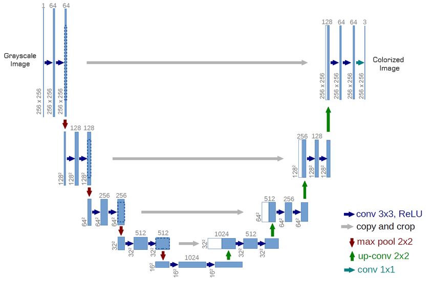
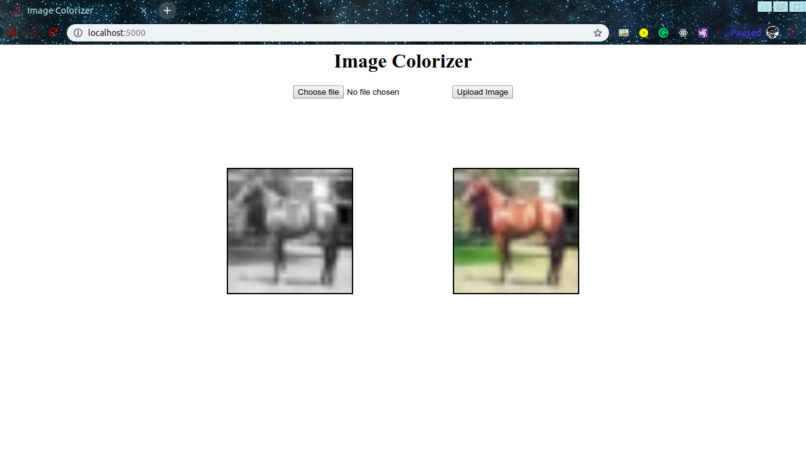

<h1>Image-Colorization</h1>
<h2>Automatic Image Colorization using a Convolutional Network (U-Net)</h2>
<ul>
  <li>Using the U-Net ConvNet Architecture for end-to-end image colorization.</li>
  <li>Takes as input a grayscale 32x32 image and returns a colorized 32x32 version</li>
  <li>The model has been trained on the CIFAR-10 32x32 images for 100 epochs.</li>
  <li>The model achieved an accuracy of <strong>55.14%</strong> and a mean absolute error(MAE) of <strong>0.0464</strong> on the test set.</li> 
 </ul>
 
<h2>Model Achitecture</h2>

The model uses U-Net architecture which uses skip connections to preserve the lower level details and structute of an image, that are lost due to contracting bottle-neck.

   <em>The U-Net Architecture</em>

 
<h2>Demo</h2>

A web interface has been implemented, where a user uploads a grayscale image as input and gets a colored image displayed as output

  <kbd></kbd> <em>Sample Run</em>

 
<h2>Requirements</h2>
<ul>
  <li>NumPy</li>
  <li>Tensorflow</li>
  <li>Keras</li>
  <li>SciPy</li>
  <li>Flask</li>
</ul>
